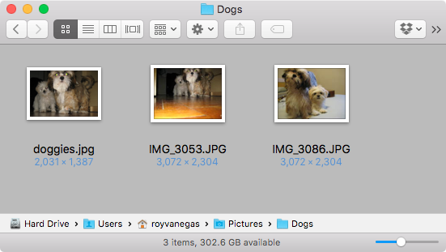
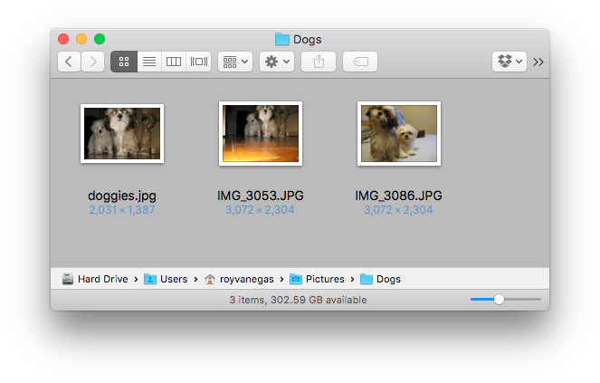

<meta charset="utf-8">
# Screenshot Shadow for Mac OS X 

v1.0.0

By default, Mac OS X creates 112-pixel box shadows around screenshots. This command line tool allows users to enable/disable the creation of those box shadows when taking screenshots.

## Screenshot Without Shadow

## Screenshot With Shadow

## Installation (Easiest)

1. Download `screenshot-shadow`:

        curl -OL https://github.com/code-warrior/screenshot-shadow/raw/master/screenshot-shadow

2. Change permissions:

        chmod 755 screenshot-shadow

3. Move the binary into your local environment:

        sudo mv screenshot-shadow /usr/local/bin

4. Run the program:

        screenshot-shadow

## Installation (Easy)

1. Download and unzip [`screenshot-shadow-master.zip`](https://github.com/code-warrior/screenshot-shadow/archive/master.zip).

2. Open The Terminal and navigate to the unzipped folder.

3. Move the binary into your local environment:

        sudo mv screenshot-shadow /usr/local/bin

4. Run `screenshot-shadow` from The Terminal:

        screenshot-shadow

## Build

Simply run `make` from this project’s root folder. Alternatively, you can compile using `gcc`:

        gcc -Wall main.c -o screenshot-shadow

## Verified On...

* Mac OS X 10.11
